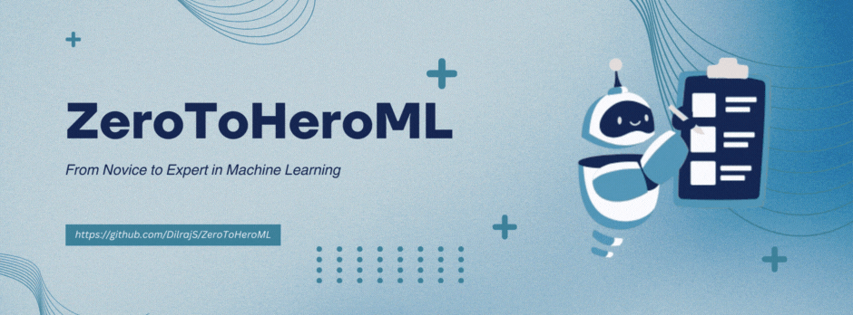

# ZeroToHeroML: From Novice to Expert in Machine Learning

Welcome to ZeroToHeroML, a comprehensive guide for those eager to master machine learning (ML) and artificial intelligence (AI). Designed with beginners and intermediates in mind, this project offers a structured journey through hands-on projects in Google Colab, covering fundamental concepts to advanced applications in the world of ML/AI.

## Project Overview

ZeroToHeroML provides a step-by-step learning path, introducing learners to essential ML/AI concepts, techniques, and real-world applications. Through interactive Google Colab notebooks, you'll progress from foundational topics to complex algorithms, building your knowledge and skills along the way.

## Getting Started

To begin your ML/AI journey with ZeroToHeroML, all you need is a Google account. Follow these steps to get set up:

1. **Download Project Files**: Download the project files from this GitHub repository. You can download individual notebooks or clone the entire repository to your local machine.

2. **Upload to Google Colab**: Go to [Google Colab](https://colab.research.google.com/), sign in with your Google account, and upload the notebook files you've downloaded.

3. **No Installation Needed**: Google Colab provides a pre-configured environment with all the libraries you'll need for ML/AI coding, so there's no need to install anything on your own machine.

4. **Cloud-Based Learning**: With Google Colab, you can leverage free access to powerful hardware accelerators like GPUs and TPUs to run your code faster.

5. **Open Access**: Google Colab is freely available to anyone with a Google account, making it an accessible platform to learn and practice ML/AI.

By following these steps, you'll be ready to dive into the hands-on projects and start coding right away!

## Table of Contents

1. **[Introduction to ML/AI](INTRODUCTION_TO_ML_AI.md)**: Start here to understand the basics and the landscape of ML and AI.
2. **[Projects](PROJECTS/)**: Embark on hands-on projects. Each project has a TODO version for you to complete and a corresponding solution:

   - [Predicting House Prices](PROJECTS/01_Predicting_House_Prices.ipynb/): Use regression to predict housing prices.
   - [Iris Flower Species Prediction](PROJECTS/02_Iris_Flower_Species_Prediction.ipynb/): Learn classification with the famous Iris dataset.
   - [Overcoming Overfitting](PROJECTS/03_Overcoming_Overfitting.ipynb/): Explore techniques to prevent overfitting in your models.
   - [Customer Segmentation](PROJECTS/04_Customer_Segmentation.ipynb/): Dive into unsupervised learning for market segmentation analysis.
   - [Deep Learning for Image Recognition](PROJECTS/05_Deep_Learning_for_Image_Recognition.ipynb/): Implement CNNs for visual recognition tasks.
   - [Natural Language Processing Sentiment Analysis](PROJECTS/06_Natural_Language_Processing_Sentiment_Analysis.ipynb/): Analyze sentiments in text data using NLP.
   - [Introduction to Reinforcement Learning](PROJECTS/07_Introduction_to_Reinforcement_Learning.ipynb/): Get to grips with the basics of reinforcement learning.

3. **[Solutions](SOLUTIONS/)**: Compare your solutions to the provided answers after completing the projects:

   - [Predicting House Prices Solution](SOLUTIONS/01_Predicting_House_Prices_Solution.ipynb/)
   - [Iris Flower Species Prediction Solution](SOLUTIONS/02_Iris_Flower_Species_Prediction_Solution.ipynb/)
   - [Overcoming Overfitting Solution](SOLUTIONS/03_Overcoming_Overfitting_Solution.ipynb/)
   - [Customer Segmentation Solution](SOLUTIONS/04_Customer_Segmentation_Solution.ipynb/)
   - [Deep Learning for Image Recognition Solution](SOLUTIONS/05_Deep_Learning_for_Image_Recognition_Solution.ipynb/)
   - [Natural Language Processing Sentiment Analysis Solution](SOLUTIONS/06_Natural_Language_Processing_Sentiment_Analysis_Solution.ipynb/)
   - [Introduction to Reinforcement Learning Solution](SOLUTIONS/07_Introduction_to_Reinforcement_Learning_Solution.ipynb/)

4. **[Datasets](DATASETS/)**: Find the datasets used in our projects, along with guides on how to access and work with them.

5. **[Extras](EXTRAS/)**: Supplement your learning with additional quizzes, assessments, and resources to further enhance your understanding of ML/AI.

## Join the Community

Share your journey, ask questions, and connect with fellow learners on platforms like Reddit, Stack Overflow, or LinkedIn using #ZeroToHeroML. Let's navigate the exciting path of ML/AI together.

## License

This project is licensed under the [MIT License](LICENSE).
